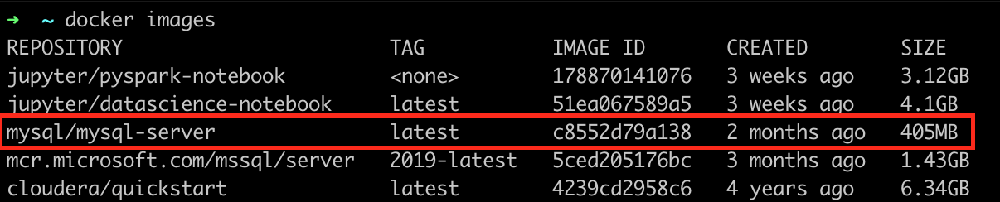
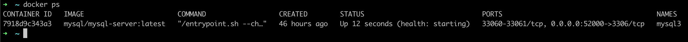
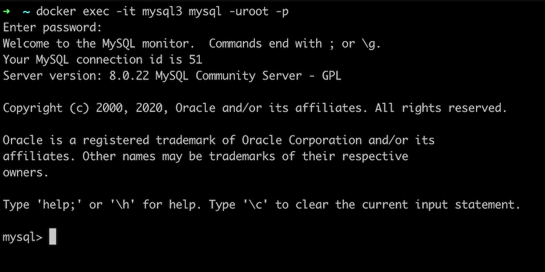
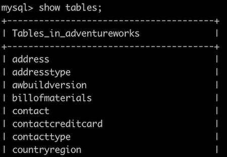

# mysql-docker-example

MySQL with the Microsoft AdventureWorks sample database converted for MySQL server, from https://sourceforge.net/projects/awmysql/

Primero, debes contar con docker instalado en tu computadora. Si no lo tienes puedes descargarlo desde aquí: [Docker Desktop](https://www.docker.com/products/docker-desktop)

## Mysql for Docker

Ahora vamos a descargar la ultima version del Mysql para Docker ejecutando el siguiente codigo en la terminal:

```
docker pull mysql/mysql-server:latest
```

Luego, comprobaremos que la imagen de mysql este descargada con el siguiente comando:

```
docker images
```

El resultado debe ser el siguiente:



Procedemos con configurar nuestra imagen de mysql con el siguiente comando:

```
docker run --name [container_name] -p 52000:3306 -e MYSQL_ROOT_PASSWORD=my-secret-pw -d mysql/mysql-server:latest --character-set-server=utf8mb4 --collation-server=utf8mb4_unicode_ci
```

En donde:

- `--name [contaiser_name]`: es el alias con el que puedes identificar tu instancia. el valor de *container_name* va sin los [].
- `-p hostPort:containerPort`: especifica tanto el puerto interno que tendra en docker como el puerto con el que puedes utilizar desde el huesped.
- `-d`: especifica la imagen de docker que vas a utilizar.
- `-e MYSQL_ROOT_PASSWORD`: establece la contraseña de tu usuario root en mysql.

Una vez ejecutado el comando anterior, podemos comprobar que la imagen esta inciado con el siguiente comando:

```
docker ps
```

El resultado debe ser el siguiente:



## Cargar AdventureWorks

Vamos a utilizar el archivo llamado `AWBackup.sql` y lo cargaremos dentro de nuestra imagen de docker. Para ello, descarga el archivo `.sql` y luego copialo al contenedor de la siguiente manera (usando la terminal):

```
docker cp Downloads/AWBackup.sql [container_name]:/mybackup.sql
```

luego, vas a acceder a MySql de la siguiente manera:

```
docker exec -it [container_name] mysql -uroot -p
```


Una vez dentro de mysql podemos importar la base de datos que copiamos siguiendo estos pasos:

1. Crearemos la base de datos con el siguiente comando de ejemplo: `CREATE DATABASE AdventureWorks;`.
2. Nos situamos en la base de datos creada: `USE AdventureWorks;`
3. Importamos el archivo `.sql` que cargamos en docker a nuestra BD con el siguiente comando: `source mybackup.sql;`
4. comprobamos que las tablas esten cargadas: `SHOW TABLES;`

El resultado seria el siguiente:



